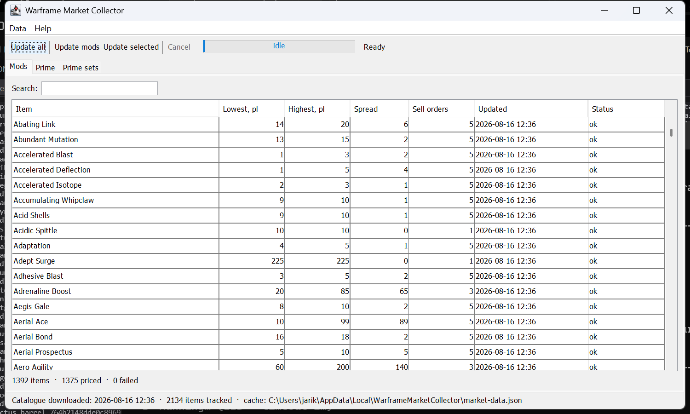
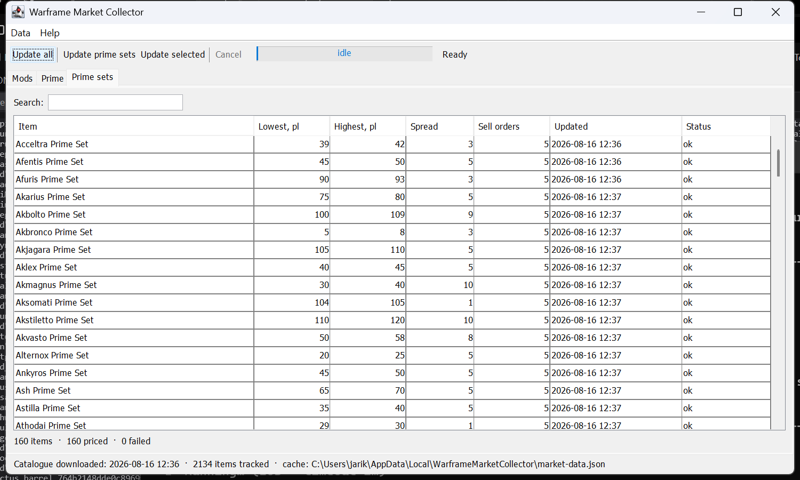

# Warframe Market Collector

A desktop application that collects the current sell-order prices of every **mod** and
**prime** item listed on [warframe.market](https://warframe.market) and shows them in a
sortable, searchable table — while staying inside the API's budget of **3 requests per
second**.



---

## What it does

1. **Downloads the item catalogue** — a single call to `GET /v2/items` returns all ~3 800
   tradable items *including their `tags`*, so no per-item request is needed just to
   classify them.
2. **Filters by tag** — only items tagged `mod` or `prime` are kept (2 134 of 3 837 at the
   time of writing).
3. **Splits them into three groups**, one tab each:

   | Tab | Rule | Items |
   | --- | --- | --- |
   | `Mods` | tagged `mod` | 1 392 |
   | `Prime` | tagged `prime`, but not a set | 582 |
   | `Prime sets` | tagged `prime` **and** `set` | 160 |

   The **most specific** rule wins, so a complete prime set goes to `Prime sets` rather
   than `Prime`; ties are broken by tab order, which keeps the two prime augment mods
   (tagged both `mod` and `prime`) in `Mods`. Every item therefore belongs to exactly one
   tab and is requested exactly once.

   
4. **Collects top sell orders** — for each item, `GET /v2/orders/item/{slug}/top` returns
   the best visible sell orders. They are sorted by price and the **lowest** and
   **highest** are stored, along with the sample size and a timestamp.
5. **Displays everything in a GUI** — one tab per category, with refresh actions for all
   items, one category, or just the selected items.
6. **Caches to disk** — results are written to a local JSON file and reloaded on the next
   start, so the app is useful immediately without re-collecting.

A full refresh is ~2 135 requests and takes **13–15 minutes**; that is a floor imposed by
the rate limit, not by the implementation.

## Rate limiting

This is the part the program is built around. All HTTP traffic passes through a single
shared `RateLimiter` (`api/RateLimiter.java`) that implements a **sliding window**: it
records the timestamp of every granted permit and refuses to hand out a fourth one until
the oldest of the last three has aged out of the window.

Why a sliding window rather than "sleep 333 ms between calls":

* it is correct with **several worker threads** acquiring concurrently,
* it stays correct when request latencies vary wildly,
* it counts **retries** (including HTTP 429 back-offs) against the same budget, so a burst
  of failures cannot cause a burst of traffic.

The window is 1 100 ms rather than exactly 1 000 ms, so clock granularity — or the server
measuring the second from when it *receives* a request rather than when we send it —
cannot push the observed rate above three. Measured throughput of a real run is
**≈2.8 requests/second**.

Four worker threads run the per-item lookups. They exist only to overlap network latency;
the limiter, not the pool size, sets the pace.

## Technologies and techniques

| Area | Choice | Why |
| --- | --- | --- |
| Language | Java 21 (`--release 21`) | Records, switch expressions, text blocks; builds on any JDK 21+ |
| Build | Gradle 9.7 (Kotlin DSL) + wrapper | No local Gradle install needed; wrapper jar is checksum-pinned |
| HTTP | `java.net.http.HttpClient` (JDK) | No third-party HTTP dependency |
| JSON | Jackson Databind 2.22 | Maps directly onto Java `record`s; unknown fields ignored so API additions don't break the app |
| GUI | Swing (JDK) | Part of the JDK — no platform-specific native libraries, so one jar runs on Windows and Linux |
| Concurrency | `ExecutorService`, `ConcurrentHashMap`, `AtomicInteger`, `ReentrantLock`/`Condition` | Background jobs, thread-safe shared state, prompt cancellation |
| Persistence | JSON via Jackson, written atomically | Human-readable cache; temp-file + atomic move means a crash can't corrupt it |
| Tests | JUnit 5 | 16 tests covering the rate limiter (single- and multi-threaded), tag filtering, order summarising, and cache round-trips |

Techniques worth calling out:

* **Callback executor injection** — `CollectorService` publishes progress through an
  `Executor` supplied by the caller. The GUI passes `SwingUtilities::invokeLater`, so
  listeners are guaranteed to run on the event dispatch thread without the service
  knowing anything about Swing. Tests pass `Runnable::run`.
* **Checkpointed saves** — the cache is flushed every 50 items, so a cancelled or crashed
  15-minute refresh does not lose everything.
* **Live table model** — `ItemTableModel` reads prices straight from the shared database,
  so refreshing one item is a single-row repaint rather than a full table rebuild.
* **Graceful degradation** — a failed item lookup is stored as a failed snapshot with its
  error message and shown in the *Status* column; it never aborts the run.

## Using the GUI

* **Update all** — re-downloads the catalogue, re-applies the tag filter, then prices
  every item.
* **Update mods / Update prime / Update prime sets** — prices every item in the current
  tab; the button follows whichever tab is open.
* **Update selected** — prices only the highlighted rows (multi-select works; also
  available from the right-click menu).
* **Cancel** — stops a running job immediately; everything collected so far is kept.
* **Search** — filters the current tab by name as you type.
* Click any column header to sort. Items with no sell orders sort together at one end.
* Double-click or right-click → *Open on warframe.market* opens the item's page.

Local data location:

| OS | Path |
| --- | --- |
| Windows | `%LOCALAPPDATA%\WarframeMarketCollector\market-data.json` |
| Linux | `$XDG_DATA_HOME/warframe-market-collector/market-data.json` (default `~/.local/share/...`) |
| macOS | `~/Library/Application Support/WarframeMarketCollector/market-data.json` |

## Building and running

Requires a **JDK 21 or newer**. Gradle itself is downloaded by the wrapper.

```bash
# Linux / macOS
./gradlew build          # compile + run tests
./gradlew run            # launch the app

# Windows
gradlew.bat build
gradlew.bat run
```

### Portable runnable jar

```bash
./gradlew fatJar
java -jar build/libs/warframe-market-collector-1.0.0-all.jar
```

The jar bundles Jackson and contains no native code, so **the same file runs on Windows,
Linux and macOS** with any JRE 21+.

### Native binaries

`jpackage` (shipped with the JDK) turns the jar into a self-contained application with an
embedded Java runtime, so the end user needs no Java installed:

```bash
./gradlew jpackageImage
```

| Host OS | Output |
| --- | --- |
| Windows | `build/jpackage/WarframeMarketCollector/WarframeMarketCollector.exe` |
| Linux | `build/jpackage/WarframeMarketCollector/bin/WarframeMarketCollector` |

Pass `-PpackageType=` to build an installer instead of a plain image:

```bash
./gradlew jpackageImage -PpackageType=exe    # Windows, requires WiX Toolset 3.x
./gradlew jpackageImage -PpackageType=msi    # Windows, requires WiX Toolset 3.x
./gradlew jpackageImage -PpackageType=deb    # Debian/Ubuntu, requires dpkg, fakeroot
./gradlew jpackageImage -PpackageType=rpm    # Fedora/RHEL, requires rpm-build
```

**`jpackage` cannot cross-compile.** A Windows `.exe` must be produced on Windows and a
`.deb` on Linux, because each embeds that platform's Java runtime and launcher. To ship
both from one machine, either run the build on each OS (a CI matrix is the usual way) or
simply distribute the portable fat jar, which needs no per-platform build at all.

Gradle's `distZip`/`distTar` tasks (from the `application` plugin) are a third option:
they produce an archive with `bin/warframe-market-collector` and `bin/*.bat` start scripts
that use whatever JRE the user has.

## Project layout

```
src/main/java/com/warframemarket/collector/
├── Main.java                    entry point: restore cache, show window
├── api/
│   ├── RateLimiter.java         sliding-window limiter (the 3 req/s guarantee)
│   ├── WarframeMarketClient.java HTTP + JSON + retry/back-off
│   ├── ApiDtos.java             wire records for the v2 API
│   └── ApiException.java
├── model/
│   ├── Category.java            MODS / PRIME / PRIME_SETS + the tag-filtering rule
│   ├── MarketItem.java
│   └── PriceSnapshot.java       lowest/highest/count/timestamp/error
├── service/
│   ├── CollectorService.java    job orchestration, worker pool, cancellation
│   ├── MarketDatabase.java      thread-safe in-memory state
│   ├── UpdateRequest.java       all / category / selected items
│   └── CollectorListener.java
├── store/
│   ├── StateStore.java          atomic JSON load/save
│   ├── PersistedState.java      on-disk schema (versioned)
│   └── AppPaths.java            per-OS data directory
└── ui/
    ├── MainWindow.java          tabs, toolbar, menus, progress
    ├── CategoryPanel.java       one tab: search + sortable table
    └── ItemTableModel.java
```

## Notes

* "Highest price" is the dearest of the *top* sell orders the API returns for an item
  (five at present), not the dearest order on the whole market. That deliberately keeps
  outlier listings from dominating the figure; the *Sell orders* column shows the sample
  size behind each row.
* Adding or changing a tab is a one-line change to the `Category` enum: the GUI builds its
  tabs from `Category.values()`, and cached items are re-classified against the current
  rule when the cache is loaded — so an existing cache moves items into a newly added tab
  without losing the prices already collected for them.
* The client requests the `pc` platform in English. Change the arguments to
  `new WarframeMarketClient(platform, language)` in `Main.java` for other platforms.
* The app needs a graphical display; on a headless Linux box run it under `xvfb-run` or
  with X11/Wayland forwarding.
